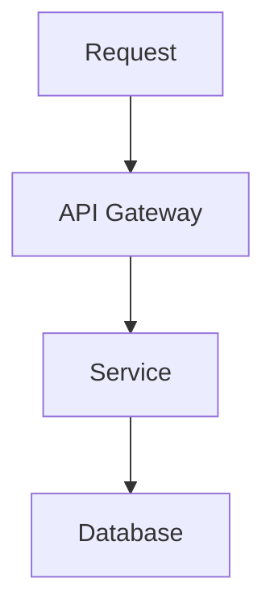

# Style Guide

This guide defines writing and formatting rules for the handbook.

## Tone

Use a clear, practical, senior-engineering tone.

Prefer:

- Simple explanations
- Real-world trade-offs
- Practical examples
- Interview-ready wording
- Clear definitions

Avoid:

- Hype
- Overly academic explanations
- Overconfident claims
- Filler paragraphs
- Unnecessary jargon
- Company-specific assumptions

## Audience

Assume the reader is an experienced developer preparing for senior-level interviews.

The reader likely knows the basics, so focus on:

- Why decisions matter
- Trade-offs
- Failure modes
- Production concerns
- Communication clarity
- Senior-level reasoning

## Language

Use English.

Use American English or neutral technical English consistently.

## Headings

Use one H1 per file:

```markdown
# React Rendering Pipeline
```

Use H2 for main sections:

```markdown
## Short Answer
## Deep Dive
## Common Mistakes
```

## Code examples

Code examples should be:

- Concise
- Correct
- Production-oriented where possible
- Focused on the topic
- Easy to copy and understand

Prefer TypeScript for JavaScript examples unless plain JavaScript is more appropriate.

## Diagrams

Use Mermaid diagrams when they make the explanation clearer.

Example:



## Interview answers

A good interview answer should:

1. Start with a clear short answer.
2. Explain the deeper concept.
3. Mention trade-offs.
4. Include a practical example.
5. Avoid unnecessary complexity.
6. Show senior-level judgment.

## Common mistakes section

Use this section to explain what candidates often get wrong.

Examples:

- Overusing a tool without understanding the trade-off
- Giving a memorized definition without practical context
- Ignoring production constraints
- Treating every architecture pattern as universally good

## References

Use references when a topic depends on external facts, standards, or official documentation.

Prefer:

- Official documentation
- Standards
- Well-known engineering resources
- Public technical articles from reputable sources

Avoid unreliable or low-quality sources.
