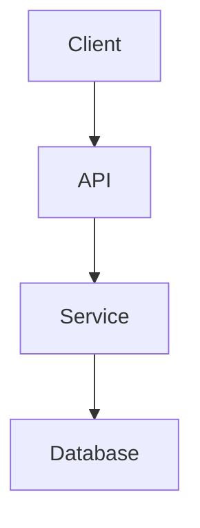

# Diagrams

This folder contains diagrams used across the handbook.

## Purpose

Diagrams should make complex ideas easier to understand.

Use diagrams for:

- Architecture flows
- Request lifecycle explanations
- System design exercises
- CI/CD pipelines
- Data flow diagrams
- Sequence diagrams
- Component relationships

## Preferred format

Prefer Mermaid diagrams when possible.

Example:



## Planned structure

```text
diagrams/
├── react/
├── nodejs/
├── architecture/
├── system-design/
├── cicd/
├── testing/
└── security/
```

## Contribution notes

Before adding diagrams:

- Keep diagrams readable
- Avoid too many nodes
- Use clear labels
- Prefer simple diagrams over complex ones
- Link diagrams from relevant documentation pages
- Keep source diagrams editable when possible
